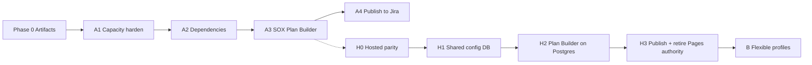

# Flexible Capacity Planner — Complex Build Plan

**Status:** Working plan (derived from Phase 0 artifacts)  
**Sources (normative):**
- [`CAPACITY_PLANNER_SPECIFICATION.md`](./CAPACITY_PLANNER_SPECIFICATION.md) — Part A (SOX) + Part B (flexible platform)
- [`HOSTED_APP_ARCHITECTURE.md`](./HOSTED_APP_ARCHITECTURE.md) — Part B runtime / SoR / cutover
- [`config.excel.example.json`](./config.excel.example.json) — Non-Jira SharePoint embed/edit contract
- [`templates/blank-styling-template.html`](./templates/blank-styling-template.html) — Mulish design tokens + layout chrome

**Non-goals for this document:** calendar-day estimates, staffing Gantt charts. Difficulty is expressed as subsystem invasiveness and dependency risk.

---

## 0. How to use this plan

| Track | Spec home | Delivery posture |
|---|---|---|
| **Track A — SOX Capacity Planner** | Spec Part A (§A9–A13) | Near-term; prove planning loop on BP SOX |
| **Track B — Flexible Platform** | Spec Part B + Hosted Arch | North star; stand up only after A Plan Builder is trusted |
| **Track H — Hosted SoR** | Hosted Arch §10 (H0–H3) | Optional parallel once A needs shared edits / auth |

**Hard sequencing rule (from Spec B8 / A12):** Do **not** block SOX Excel migration on multi-profile flexibility. Prove `read → plan → publish to Jira` on SOX first.



---

## 1. Product layers (shared vocabulary)

Freeze these names everywhere (Spec A11 Phase 0 exit criteria):

| Layer | Question it answers | Primary entities |
|---|---|---|
| **L0 — Inputs & assumptions** | What rules and calendars apply this cycle? | `PlanningPolicy`, `Assumption`, phase/sample tables, resource profiles |
| **L1 — Plan objects & dependencies** | What do we test, when can we start, what blocks us? | `WorkObject`, `PlanItem`, `Dependency`, scenarios |
| **L2 — Capacity & workload** | Who is overloaded in which week? | `HourAllocation`, capacity views, alerts |

**SoR split (A10.1 / Hosted §11):**

| Data | SoR |
|---|---|
| Execution status, comments, live estimates once testing starts | **Jira** |
| Cycle policies, assumptions, phase rules, calendars, pre-publish plan | **Planning Platform** |
| Control master | RCM → platform cache |
| PTO / holidays | HR/calendar or Resource UI |
| Ad-hoc non-SOX / Non-Jira work | Platform `PlanItem` (`source=manual`) — not SharePoint iframe forever |

---

## 2. Artifact inventory & gaps to close in Phase 0+

| Artifact | Role today | Gaps / next |
|---|---|---|
| Spec Part A | SOX behavior + Excel archaeology | Still need `FieldDefinition` draft YAML from All Up columns |
| Spec Part B | Flexible thesis + domain model | Profile schemas (`sox-bp`, later `ops`, `project`) TBD |
| Hosted architecture | Stack, tables, API, H0–H3 | Resolve open hosting/IdP questions (Hosted §14) |
| `config.excel.example.json` | Non-Jira embed/edit URLs only | Expand toward full Excel interchange map (All Up import/export) **or** keep Non-Jira-only and add `config.all_up.example.json` |
| `templates/blank-styling-template.html` | UI shell + CSS tokens | Use for every new section; preserve split-grid IA |
| Live capacity repo (external) | `sync → generate → patch → Pages` | Remains Track A runtime until H cutover |

**Repo hygiene done in this PR:** styling template path aligned to spec (`templates/…`).

---

## 3. Track A — SOX Capacity Planner (complex delivery)

### A0 — Stabilize knowledge (spec Phase 0)

**Goal:** Stop knowledge loss; freeze contracts before code sprawl.

| Work item | Detail | Exit |
|---|---|---|
| Spec + README alignment | Correct outdated “four tabs / Test Plan-WP” docs | Docs match live IA |
| Field catalog draft | All Up columns → `FieldDefinition` YAML (`static` \| `dynamic`, type, source, validation) | Reviewed by BP lead |
| Naming freeze | PlanItem, Policy, Dependency, Scenario, PlanningCycle, Resource | Used in code + docs |
| Pipeline health | Keep hourly Jira → SQLite → HTML/XLSX → Pages green | No regression on L2 |

**Key functionality considerations**
- Catalog **rules**, not DNU sheets / `#REF!` VLOOKUPs (A12.8).
- Classify every All Up concept as static vs dynamic (A7.4) before building UI.
- Decide open questions A13 early enough to avoid dual math (32 vs daily; review % variants; publish timing).

---

### A1 — Capacity hardening (still GitHub Pages)

**Goal:** Absorb highest-value Excel L0 concepts **without** rewriting architecture (Spec A11 Phase 1).

| # | Feature | Behavior | Invasiveness |
|---|---|---|---|
| A1.1 | Resource availability overlay | Holidays + per-person weekly (or daily×working days) capacity; show **remaining = capacity − load** | Medium — touches `generate.py` capacity cells + Excel export bands |
| A1.2 | `PlanningPolicy` knobs | Versioned JSON: `weekly_capacity_hours`, `review_ratio`, `review_floor`, overload bands, spread lag, alert proximity | Low–medium — extract magic numbers (A5.1) |
| A1.3 | Align review math | Flag for `max(test×0.35, 1)` and optional 40% TOE/Annual variant | Low — must not silently diverge from Jira export |
| A1.4 | Assumptions panel | Cycle-tied markdown/JSON visible on Capacity header | Low |
| A1.5 | Non-Jira Tasks v1 | Replace iframe (`config.excel*.json`) with editable tasks **included in capacity math** | Medium — new persistence (JSON/SQLite); UI section |
| A1.6 | Changelog → drift UI | Wire existing `issue_changelog.json` into “changed since baseline/export” | Medium — data exists, unused (A4.3) |
| A1.7 | A3 tab (if real) | Render A3 like BP/IT; stop orphaning `capacity_groups` A3 | Low |
| A1.8 | Three-band coloring (optional) | Unify HTML with Excel export bands (Appendix A) | Low — design decision |

**Still Excel after A1:** phase placement authoring, PBC matrix authoring, ready-to-test rule ownership.

**Key functionality considerations**
- **Availability honesty:** All Up uses ~4–7h/day × working days − PTO, not flat 32. Prefer profiles even if UI still shows weekly totals (A12.4).
- **Shared vs local:** Deactive users stay shared; team membership must not remain `localStorage`-only forever (A6.4 / Hosted §2.2).
- **Non-Jira:** Treat as first-class capacity contributors via `CapacityContributor` interface (A4.4), not an embed.
- **Spread Work:** Remains UI-only alternate; export stays due-week-only unless policy explicitly changes (A3.4).
- **Overload semantics:** `> capacity` only (exactly at cap is OK) — preserve unless policy says otherwise (A3.3).

**Success metrics**
- Remaining-capacity view matches All Up intuition for a known person-week sample.
- Non-Jira hours appear in Overall/BP/IT grids.
- Review policy flag produces identical numbers to Excel for fixture set.

---

### A2 — SOX Dependency & readiness tracker

**Goal:** Model gates that live in Excel / heads today (Spec A9 Step 2).

**Gate types (minimum set)**

1. PBC readiness → ready-to-test  
2. Sample selection chain: Due#1 → selections (+7) → Due#2 (+7)  
3. Review lag: test due → review due (+7 / +21 + override)  
4. Phase threshold: ready date vs TOE-1 / TOE-2 cutoff  
5. Staffing / TBD role dependencies  
6. External alignment flags  
7. Calendar blackouts  

**UI:** New **Dependencies & Readiness** section in existing IA (not a separate product). Use blank template chrome (section tabs + view tabs).

**Rule modules to implement as pure functions (A10.2)** — unit-test before UI:

| Module | Spec home | Inputs → output |
|---|---|---|
| `period_normalizer` | Calc Conversion | Period labels → canonical keys |
| `pbc_calendar` | CALC-PBC Dates | Control × test period → PBC Due #1 |
| `ready_to_test` | TOE,RF Plan!M | Sampling/evidence/method → Ready date |
| `phase_assigner` | By Phase + threshold | Ready + sample table → TOD/TOE-1/TOE-2/RF/Annual |
| `date_policy` | Review due rules | Test due + cutoff + override → Review due |
| `effort_model` | Review % / floor | Test hours → review hours |
| `availability_model` | Capacity Plan grid | Profiles − time off → weekly capacity |
| `capacity_engine` | Existing app | Due-week + spread allocations |

**Key functionality considerations**
- Ready-to-Test is the **keystone dependency** (A12.3) — promote to first-class computed field, not Spread heuristic only.
- Frequency-driven / point-in-time vs sample-driven branches must match Excel exactly (A7.3).
- Multiple linked PBCs → **latest** start (already in Spread); keep consistent in readiness.
- Blackouts (month-end, wellness, India holidays, shutdown weeks) are first-class L0 inputs (A7.5.6), not footnotes.
- TBD roles (`Senior-TBD`, …): decide Resource vs placeholder **before** staffing dependency UX (A13.4).

**Success metrics**
- Fixture controls from All Up produce identical Ready / Phase / Review Due as Excel formulas.
- Readiness % view is trustworthy enough to replace informal Metrics glances for one phase.

---

### A3 — SOX Plan Builder (All Up spine in-app)

**Goal:** `TOE,RF Plan` lives in the app (Spec A11 Phase 2).

**PlanItem spine (editable)**
- Test period, reliance, test hours, tester, reviewer, test due  
- Computed: ready-to-test, review due, phase, unique key  
- Attributes bag for SOX yearly columns via `FieldDefinition` registry (B3 / Hosted §4.3)

**Supporting imports**
- Seed `CALC-PBC Dates` + PBC methods via CSV  
- Import All Up / Jira → PlanItems  
- Export PlanItems → Excel safety net  

**Capacity toggle:** **Jira execution** vs **Plan scenario** (same L2 UI, different allocation source).

**Provider interface (introduce here even on Pages/SQLite)**

```
PlanningSource
  discover_schema() -> FieldCatalog
  fetch_entities(scope) -> list[RawEntity]
  normalize(raw, field_map) -> list[WorkItem]

CapacityContributor
  contributes_hours(work_item) -> list[HourAllocation]
```

Adapters: Jira (existing), Manual/Non-Jira, CSV (All Up), later RCM / PTO.

**Key functionality considerations**
- Do **not** HTML-clone 30 sheets — migrate process into typed entities (A1).
- Decisions **before** capacity (scope, reliance, phase, period, readiness, blackouts, staffing, hour/date strategy) must be first-class PlanItem/Policy fields (A7.5).
- Scenarios before free-edit-on-live-plan (Hosted decision log #3).
- Dual-entry for at most one cycle; then publish path (A11 success metric / A12.6).
- Switch planning authority on a **phase boundary**, never mid-TOE (A11 gradual transition).

**Success metrics**
- Planners edit dates/owners in Plan Builder first for a full phase.
- Round-trip: All Up sample → import → export preserves spine fields.
- Capacity scenario vs Jira execution diffs are explainable ticket-by-ticket.

---

### A4 — Publish to Jira + configurable alerts

**Goal:** Explicit approve + diff before writeback (Spec A9 Step 4 / Hosted §8.2).

**Publish contract (minimum fields)**
- QA Agent, Approver  
- Tester Due Date, Review Due Date  
- Original Estimate  
- Control Group  
- Reliance (if writable)  
- Optional create/link PBC requests  

**Conflict policy:** Jira wins on status/comments; scenario wins on planning fields **only when publishing**. Post-publish Jira edits → drift alerts.

**Alerts:** Move from “open GitHub issue” stubs to in-app rule evaluation (PBC reporter mismatch, date proximity, drift, overload).

**Key functionality considerations**
- Mental model = Excel `WP Changes` / `_WP Original` (A5.2 / A10.3).  
- Never silent writeback on blur (B9.5 / Hosted #4).  
- Jira token rotation / least-privilege bot user (Hosted §9).  
- Audit every publish (SOX evidence hygiene).

**Success metrics**
- Dry-run publish reviewed by BP lead with zero unintended field writes.
- One phase boundary cutover: Plan Builder authority → Jira via publish.

---

## 4. Track H — Hosted application cutover (Part B runtime)

Use when shared edits, SSO, or Plan Builder concurrency outgrow Pages. **Can begin after A1 or in parallel with A3**; must not redefine SOX product scope.

| Phase | Goal | Parity bar |
|---|---|---|
| **H0 — Parallel read** | FastAPI + Postgres + SSO shell + blank template; port `sync.py` → `jira_issues`; recreate Capacity read-only via API | Capacity totals match Pages within rounding for **2 sync cycles** |
| **H1 — Shared config in DB** | Resources, deactive, teams, weekly/daily capacity, Non-Jira `plan_items`, assumptions/policies in admin UI | localStorage no longer SoR for teams |
| **H2 — Plan Builder on Postgres** | Import All Up → `plan_items`; engines; scenario vs execution toggle | One phase planned primarily in Plan Builder |
| **H3 — Publish & retire Pages authority** | Diff publish; Pages optional mirror or decommission; Excel = interchange | Publish dry-run approved; SSO roles assigned |

**Stack defaults (Hosted §2.1):** FastAPI, PostgreSQL, OIDC SSO, React/Vite or HTMX, Redis workers, object storage for XLSX, container PaaS.

**Module map (replace monolith `generate.py`)**

| Module | Responsibility |
|---|---|
| `providers.jira` | Field discover, fetch, normalize |
| `engine.ready_to_test` / `dates` / `effort` / `availability` / `capacity` / `alerts` | Pure calc |
| `services.publish` / `export` | Writeback + XLSX |
| `api.*` | HTTP + AuthZ |

**API surface (illustrative):** cycles, policy, plan-items, dependencies, capacity, resources, alerts, sync, scenarios/publish, exports, me/preferences — see Hosted §5.

**Key functionality considerations**
- Postgres SoR; SQLite only for local Jira mirrors (Hosted #1).  
- SSO before real Plan Builder data (Hosted #2).  
- JSONB `attributes` + `field_definitions` — no migration per Excel column (Hosted §4.3 / B3).  
- Roles: Viewer / Planner / Publisher / Admin (Hosted §3.2).  
- Keep Mulish tokens / split-grid UX (A6 / Hosted #6).  
- Resolve Hosted §14 open questions (where hosted, IdP claims, Pages mirror, retention, on-call) before H1 production data.

---

## 5. Track B — Flexible Planning Platform (after SOX trust)

**Only after** SOX Plan Builder trusted for ≥1 phase boundary (A12.10 / B8).

### B capability expansion map

| Capability | SOX proof | Generalization |
|---|---|---|
| Capacity | Test + review hours | Configurable FTE/hours models per profile |
| Dependencies | PBC → ready → test → review | Arbitrary predecessor / gate graphs |
| Workload | Balance testers | Intake queues, WIP limits, prioritization |
| Roadmapping | TOD→…→Annual | Quarters, releases, milestones |
| Resources | TBD roles, IST, PTO | Skills, hiring plans, shared pools |

### B domain model (same spine, profile-aware)

`PlanningCycle` (profile = `sox-bp` \| `ops` \| `project` \| …) · `PlanningPolicy` · `Resource` / profiles / time_off · `Assumption` · `WorkObject` · `PlanItem` · `Dependency` · `ForecastFactor` · `HourAllocation` · `Scenario` / baselines · `FieldDefinition` · `Provider`

### B UX sections (profile-aware)

1. Cycle / Profile Setup  
2. Plan Builder  
3. Dependencies & Readiness  
4. Capacity / Workload  
5. Execution Sync (navigator, alerts, publish)  
6. Insights (readiness %, burn, remaining)

**Key functionality considerations**
- Extensibility rule: unknown fields → `attributes{}` + registry; new forecast factors register as rules (B3).  
- Adapter loop: `Provider → normalize → PlanItem store → Rule engine → Capacity engine → Views` (+ optional publishers).  
- Non-ticket work = `PlanItem` with `source=manual` (B6) — retires SharePoint iframe pattern in `config.excel.example.json`.  
- One design system across profiles (B9.4).

---

## 6. Cross-cutting key functionality checklist

Use this as a design review gate for every feature PR:

### Capacity math
- [ ] Gross vs net capacity (profiles − PTO/holidays/blackouts)  
- [ ] Tester vs reviewer contribution rules preserved  
- [ ] Due-week vs Spread modes explicitly labeled; export policy clear  
- [ ] Overload threshold from `PlanningPolicy`, not magic `32`  
- [ ] Hour allocations attributable to a PlanItem / work key (drill-down)

### Planning brain (L0/L1)
- [ ] Ready-to-test computed, not only inferred for Spread  
- [ ] Phase assignment + period normalization versioned per cycle  
- [ ] Reliance / sampling / evidence as plan attributes  
- [ ] Assumptions visible and owned  
- [ ] Dependencies typed with status (static vs dynamic)

### Flexibility without chaos
- [ ] New columns → FieldDefinition, not hard-coded schema  
- [ ] Providers behind interface; capacity engine adapter-agnostic  
- [ ] Scenarios + baselines before multi-user free edit  
- [ ] Explicit publish + audit; no silent Jira writes  

### Excel / interchange
- [ ] Import validates → previews diff → commits  
- [ ] Export uses templates; stable logical field names via maps  
- [ ] Non-Jira config (`config.excel.example.json`) either replaced by PlanItems or kept as transitional embed only  
- [ ] All Up import trusted before Excel authoring SoR is dropped  

### UX / design system
- [ ] Mulish + tokens from blank template  
- [ ] Split person pane + week grid preserved for capacity  
- [ ] Badges over cards; no purple-gradient / cream-serif drift  
- [ ] New sections fit existing top-nav IA  
- [ ] Shared preferences eventually DB-backed  

### Security / compliance
- [ ] Secrets not in git; Jira creds in secrets manager  
- [ ] AuthZ on mutate/publish  
- [ ] Audit publish + policy changes  
- [ ] Authenticated exports  

---

## 7. Suggested repo / package shape (target)

```
one-more-column/
├── CAPACITY_PLANNER_SPECIFICATION.md
├── HOSTED_APP_ARCHITECTURE.md
├── BUILD_PLAN.md                          ← this file
├── config.excel.example.json
├── templates/blank-styling-template.html
├── schemas/
│   ├── field_definitions.sox-bp.yaml      ← A0 deliverable
│   └── planning_policy.schema.json
├── engines/                               ← pure Python, unit-tested
│   ├── ready_to_test.py
│   ├── dates.py
│   ├── effort.py
│   ├── availability.py
│   ├── capacity.py
│   └── alerts.py
├── providers/
│   ├── base.py
│   ├── jira.py
│   ├── manual.py
│   └── csv_all_up.py
└── (hosted app tree when Track H starts)
    ├── api/
    ├── worker/
    ├── web/
    └── db/migrations/
```

Pages-era capacity repo can remain separate until H0 ports sync/generate; this repo is the **spec + engines + eventually hosted SoR** home unless/until repos merge.

---

## 8. Cycle-based transition playbook

| Cycle | Authority | App role |
|---|---|---|
| **N** | Excel plans → manual Jira | Visualize L2 (today) |
| **N+1** | Excel + Plan Builder import; Excel still authority | Validate engines on real data |
| **N+2** | Plan Builder authority; Excel export backup | Toggle scenario capacity |
| **N+3** | Publish to Jira; Excel optional | Diff publish + drift alerts |

Cut authority only on phase boundaries (e.g., RF start or next FY TOD).

---

## 9. Decision log (defaults until overturned)

| # | Decision | Source |
|---|---|---|
| 1 | SOX-scoped delivery before multi-profile | A12.1 / B8 |
| 2 | Postgres SoR for hosted; not SQLite prod | Hosted #1 |
| 3 | SSO before real Plan Builder data | Hosted #2 |
| 4 | Scenarios before free-edit-on-live | Hosted #3 |
| 5 | Explicit publish only | Hosted #4 / B9.5 |
| 6 | Pages may mirror one cycle after H0, then sunset | Hosted #5 |
| 7 | Same CSS tokens / Mulish | A6 / Hosted #6 |
| 8 | Jira remains execution SoR | A10.1 |
| 9 | FieldDefinition + attributes early | B9.3 |
| 10 | Do not migrate DNU / broken formulas | A12.8 |

---

## 10. Open questions (blockers to resolve)

**From Spec A13**
1. First Jira writeback allowed in FY26 RF or only FY27 TOD?  
2. Review hours: flat 35% vs `max(×0.35,1)` vs 40% by phase?  
3. Who seeds yearly PBC calendar?  
4. TBD roles = Resources or placeholders?  
5. Leadership reporting: flat 32 vs person-specific daily model?

**From Hosted §14**
6. Hosting target (PaaS / VM / Cloud Run / …)?  
7. IdP group → Viewer/Planner/Publisher/Admin mapping?  
8. Keep public/private Pages mirror after SSO app?  
9. Retention for raw `jira_issues` JSON + audit logs?  
10. On-call owner for sync failures (Enablement vs BP)?

**From this repo’s current Excel config**
11. Expand `config.excel.example.json` into full All Up field map, or add a separate All Up interchange config and keep this file Non-Jira-only?

---

## 11. Immediate next actions (post–Phase 0)

1. Resolve open questions §10.1–2 and §10.5 (math + publish timing) with BP lead.  
2. Author `schemas/field_definitions.sox-bp.yaml` from All Up spine + Planning sheet.  
3. Extract pure `engines/*` from capacity math / Excel rules with golden fixtures.  
4. Implement A1.1–A1.5 on current Pages pipeline (or H0 if rehost decision lands).  
5. Keep Part B profiles off the sprint board until A3 success metric is hit.

---

*When implementation starts: Spec = product/domain bible; Hosted Arch = runtime bible; this Build Plan = sequencing & acceptance. Update all three when decisions land.*
